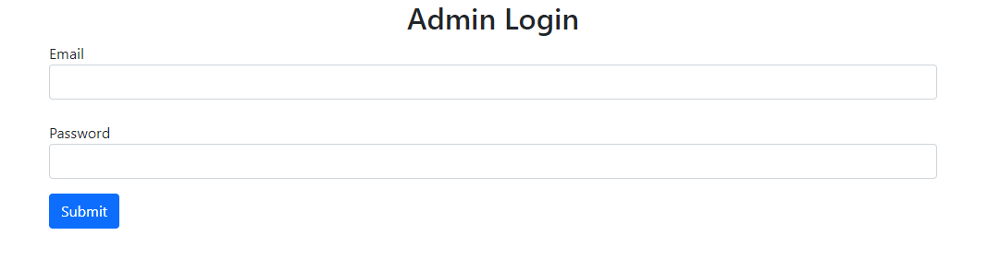

# Okul Ders Kayıt Sistemi

## Tanıtım

Okul kayıt sistemi ile öğrencilerin dönem başı alacağı dersleri seçebilmesi ve Uzman kullanıcılar tarafından ise 
- Ders Ekle / Sil / Güncelle
- Öğretim Görevlisi Ekle / Sil / Güncelle
- Sınıf Ekle / Sil / Güncelle
- Öğrenci Ekle / Sil / Güncelle

gibi işlemlerin yapabilmesi gerekmektedir ayrıca iki tip kullanıcı da sisteme login olmalıdır. Öğrenciler uzman kullanıcılar tarafından sisteme eklenerek verilen şifre ile işlemlerini tamamlamalıdır.

Öğrenciler 3 adet zorunlu 2 adet de seçmeli ders seçmek üzere toplam 5 adet ders almak zorundadır ve öğrenciler aynı dersi iki defa seçememektedir. 


## Kullanılan Teknolojiler

- NodeJS (REST API)
- Mongoose (MongoDB)-(Veritabanı)
- Jsonwebtoken (Şifreleme için)
- ReactJS (Client)

## Başlangıç

- Başlatma

```Bash
# server
npm i && npm start
# client
npm i && npm start
```


- Admin login sayfası

  

```Bash
# admin login için 
Email => admin1@gmail.com
Password => admin123
```

- Student login sayfası

  

```Bash
# student login için 
Student Code => 2021000030 (veya admin olarak giriş yaptıktan sonra bir öğrenci ekleyerek login olabilirsiniz)
Password => 12345678
```


- Öğrenci ana sayfası

  


- Öğrenci 5 ders seçimi sonrası

  


- Öğrenci aynı dersi almaya çalıştığında ki hata ekranı

  


- Öğrenci zorunlu derslerden 3 taneden fazla almaya çalıştığında ki hata ekranı

  


- Öğrenci seçmeli derslerden 2 taneden fazla almaya çalıştığında ki hata ekranı

  


- Admin ana sayfa

  


- Admin ders sayfası

  

- Admin öğretim görevlisi sayfası

  


- Admin sınıf sayfası

  


- Admin öğrenci sayfası

  

- Admin öğrenci ekleme hata ekranı

  